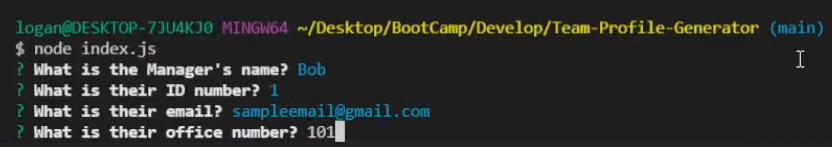

## Challenge Ten Team-Profile-Generator

### Description
The challenge this week was to take our Object Oriented Programming knowledge and pair it with what we learned from using inquirer the previous week. This involved creating several Classes such as Employee, Manager, Engineer and Intern. Likewise, unit tests were written for each of these files to ensure they first failed and then functioned as intended. In the end, these elements culminated in a functioning Team Profile generator.

### Screenshots

In order to check that the tests suceed, invoke the jest script as follows

You should see something like this if the tests were sucessfull 

Next to invoke the program, type the following and you'll be presented with the Manager inquirer prompts

Following that, you'll be asked if you would like to add an Engineer or Intern, and fill out simmilar questions for them until you select Finish.

Finally, when you select finish, your file will be generated and you and you should see this message

### Links
Github: [Link](https://github.com/LoganDufek/Team-Profile-Generator)
YouTube: [Link](https://www.youtube.com/watch?v=vL-9BO4asFA)